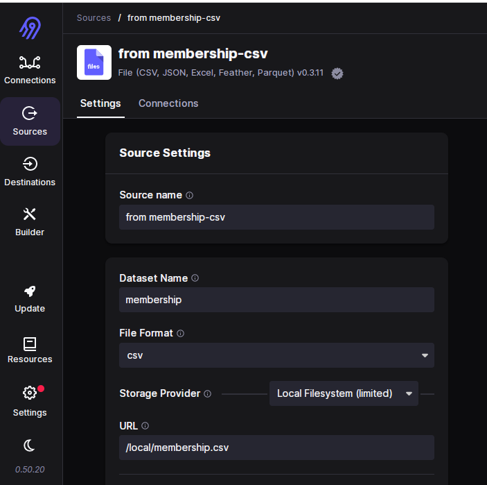
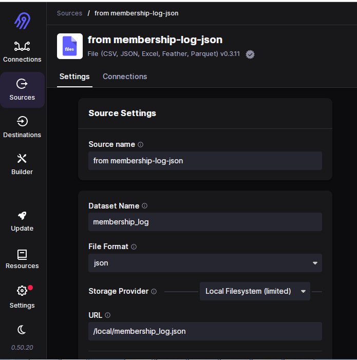
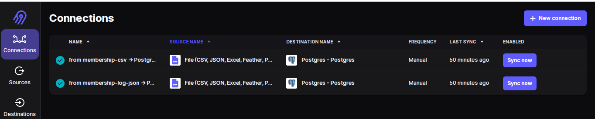
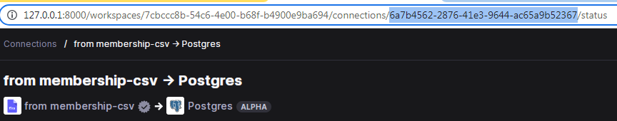
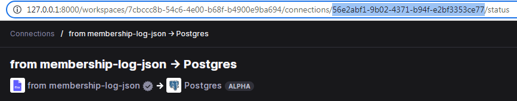
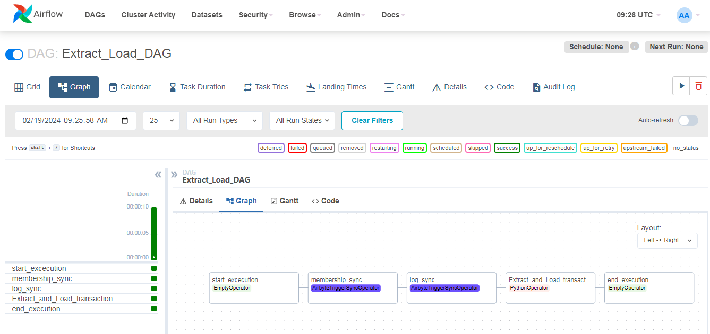
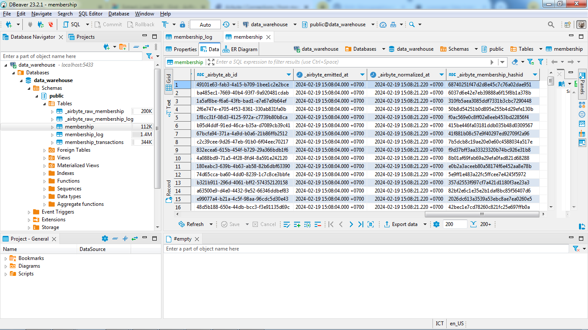

# 📌 In this airbyte branch
- Using Airbyte by creating connections to extract and load data from local file to data warehouse
- Using Airflow to trigger Arbyte to sync data with Airbyte connections

# 🏃 How to start

Set `LOCAL_ROOT` and `LOCAL_DOCKER_MOUNT` in [.env](airbyte/.env) file with path to `dataset/` directory in your local

Run function up in `docker.sh` file to run both docker compose Airbyte and Airflow
```
./docker.sh up
```

Then you can access Airbyte at `localhost:8000` and Airflow at `localhost:8080`

In Airbyte, define 2 Sources, both are from File (CSV and JSON) and 1 Destination (Postgres). Then create 2 Connections from each source to Postgres.

TIPS:
- fill URL to Local Filesystem with `/local/<filename>`
- if there's a problem to read json file, add Reader Options field while define the source with `{"encoding":"utf-8-sig"}`





Copy and paste each id connections into `membership_conn_id` and `log_conn_id` in [dag_sync_airbyte.py](dags/dag_sync_airbyte.py).




In Airflow, set 2 connections, `call-airbyte` and `pg_conn`. Configure it with settings similar to those in the existing configuration in [env](airbyte/.env) and [docker-compose.yaml](docker-compose.yaml).

After that, the rest steps are the same with the main branch. You can run/trigger the Extract_Load_DAG first.




Before run dag_dbt, do Data Cleaning for each table with SQL in DBeaver to handle duplicate data, missing data, incorrect data type, inconsistent data, etc. You can see how to do the query in these files: [membership](cleaning_data_membership.sql), [log](cleaning_data_membership_log.sql) and [transaction](cleaning_data_transaction.sql)

Next, you can access Metabase at localhost:3000. Configure the connection to the PostgreSQL data warehouse. Unleash your imagination and creativity to visualize data using Metabase.

Run function down in `docker.sh` file to stop and remove all containers and volumes
```
./docker.sh down
```
